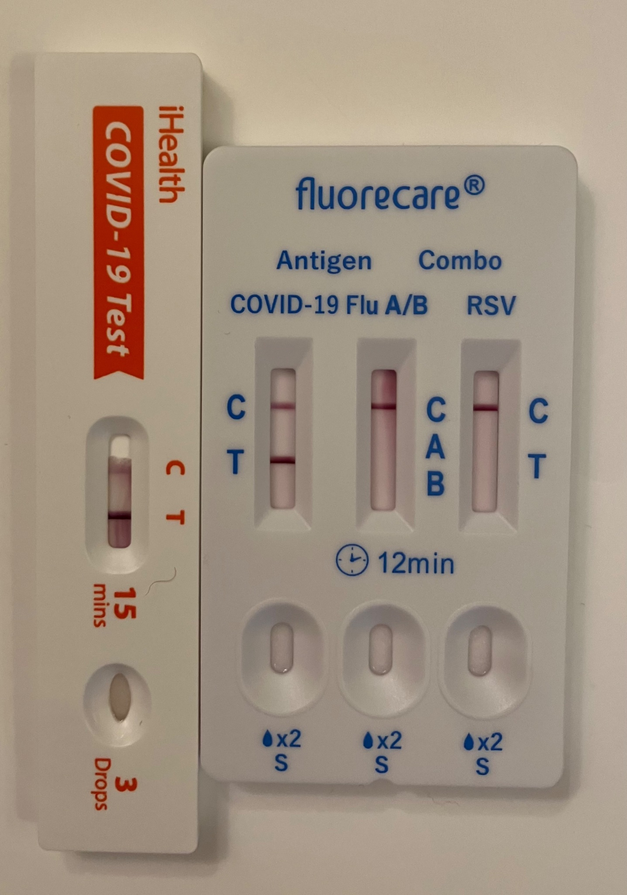

# X thread 1893061064662884675

Source: https://x.com/famulare_mike/status/1893061064662884675
Captured: 2026-06-19T20:36:32.520Z
Tweets captured: 13

## Top-level tweet: 1893061064662884675

- Author: Mike Famulare @famulare_mike
- Time: 2025-02-21T22:11:43.000Z
- URL: https://x.com/famulare_mike/status/1893061064662884675

Whelp. ‘Twas a good run!

Media:

---

## Reply: 1893061205087981668

- Author: Justin Savage @fiend_data
- Time: 2025-02-21T22:12:17.000Z
- URL: https://x.com/fiend_data/status/1893061205087981668

Oh crap. Hope you get well soon

---

## Reply: 1893070489314312646

- Author: Mike Famulare @famulare_mike
- Time: 2025-02-21T22:49:10.000Z
- URL: https://x.com/famulare_mike/status/1893070489314312646

Boring so far 🤞🏻. Thought it was a cold but maybe flu (since that’s everywhere right now). Coming up red hot for Covid was a big surprise!

---

## Reply: 1893083560124268757

- Author: Euan Arnott @Nucleocapsoid
- Time: 2025-02-21T23:41:07.000Z
- URL: https://x.com/Nucleocapsoid/status/1893083560124268757

Really hope you get well soon with no lingering problems!

Please take it EASY.

Has it been a while since last one? (if I may ask)

Interested because I have been waiting for my own 2nd "hot positive" for a while with some surprise it hasn't happened already!

LP.8.1 perhaps?

---

## Reply: 1893085094593916968

- Author: Mike Famulare @famulare_mike
- Time: 2025-02-21T23:47:13.000Z
- URL: https://x.com/famulare_mike/status/1893085094593916968

Thanks! As far as I know, this is my first. And my family’s first, but it could’ve ridden in on someone or somewhere else. I’ve been relaxed in the low prevalence period.

---

## Reply: 1893085120971841884

- Author: Mike Famulare @famulare_mike
- Time: 2025-02-21T23:47:19.000Z
- URL: https://x.com/famulare_mike/status/1893085120971841884

But yeah, I’m gonna be chill. Also started metformin and will start pax tmrw (I’m low risk IC from MS). So not too worried.

---

## Reply: 1893086954524119481

- Author: Euan Arnott @Nucleocapsoid
- Time: 2025-02-21T23:54:36.000Z
- URL: https://x.com/Nucleocapsoid/status/1893086954524119481

Treatment plan good - we don't get that in UK.  Well done for (probably) escaping prior to now!

My only RAT +ve acute phase not too bad, but post-viral 3m exhaustion & then long-term memory impairment rather worse 😥

Have to imagine Paxlovid improves prospects.  Bon chance!

---

## Reply: 1893112891655512344

- Author: Daniel Klein @daniel_j_klein
- Time: 2025-02-22T01:37:40.000Z
- URL: https://x.com/daniel_j_klein/status/1893112891655512344

Ugh, sorry

---

## Reply: 1893191529638089015

- Author: Gerry Kahle @gerrythek
- Time: 2025-02-22T06:50:09.000Z
- URL: https://x.com/gerrythek/status/1893191529638089015

You really did have a good run avoiding it. Sorry it caught up to you. Hope you’re only down for a few days.

---

## Reply: 1893204803284521054

- Author: lejandro Miranda @laalejandro @ Mastodon + BSky @LAalejandro
- Time: 2025-02-22T07:42:53.000Z
- URL: https://x.com/LAalejandro/status/1893204803284521054

Ufff...I'm sorry.

---

## Reply: 1894082907934773698

- Author: Mike Famulare @famulare_mike
- Time: 2025-02-24T17:52:10.000Z
- URL: https://x.com/famulare_mike/status/1894082907934773698

Sorry to hear about the LC! Although these might be good years to remember less of…

---

## Reply: 1894086944851698021

- Author: Euan Arnott @Nucleocapsoid
- Time: 2025-02-24T18:08:12.000Z
- URL: https://x.com/Nucleocapsoid/status/1894086944851698021

No control group to check if it is just aging, or course.  Clearly everyone needs an identical twin for that, but only a few are so lucky.

---

## Reply: 1894088623852564802

- Author: Euan Arnott @Nucleocapsoid
- Time: 2025-02-24T18:14:53.000Z
- URL: https://x.com/Nucleocapsoid/status/1894088623852564802

Was also reassured to hear I was not  only one who thought "ah, now to experiment with my illness"!  Let's see where antigen is at each stage, & how about CRP & D-dimer?  Measuring last one WAS illuminating - so later literature on fibrin (& megakaryoctes) had special interest!

---
