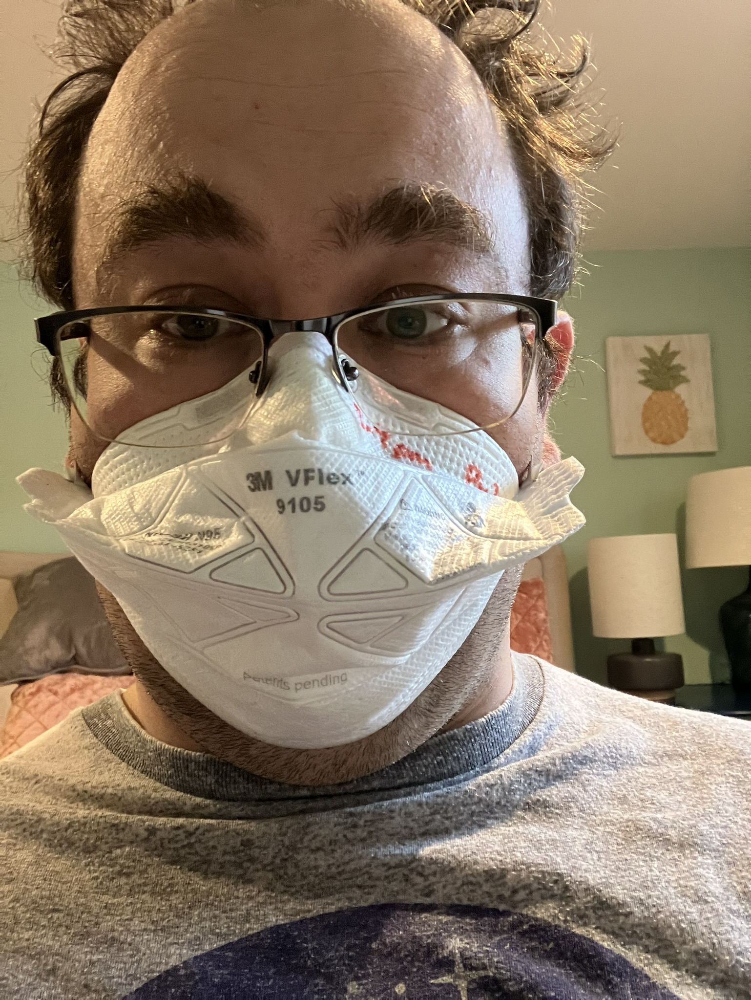
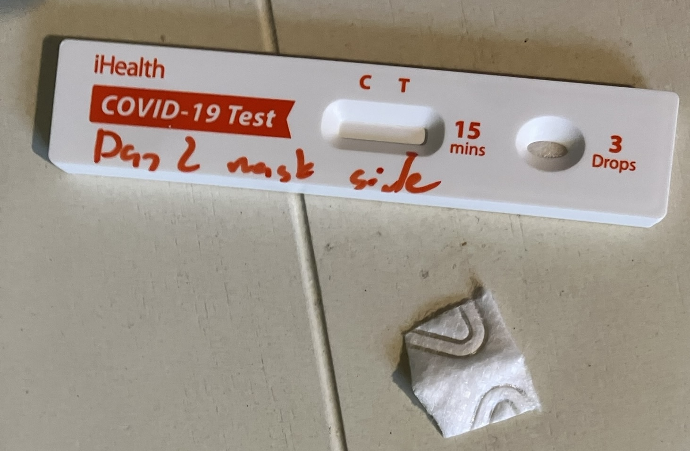
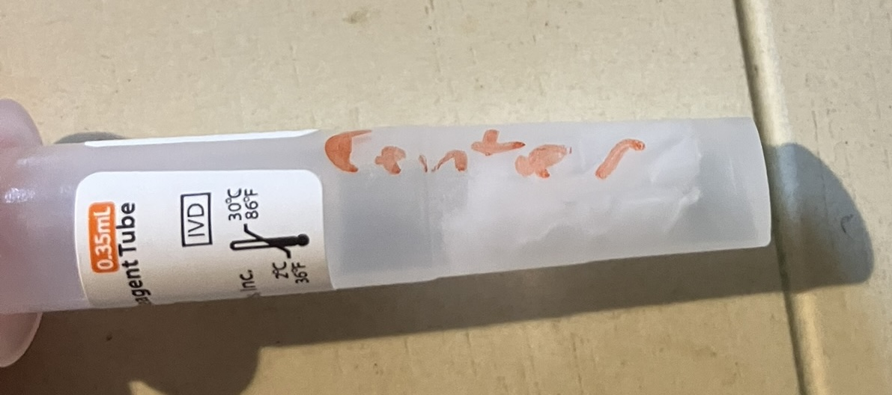
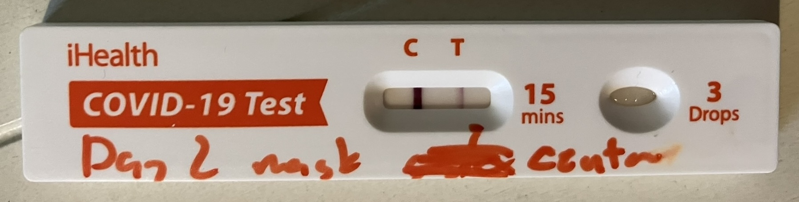
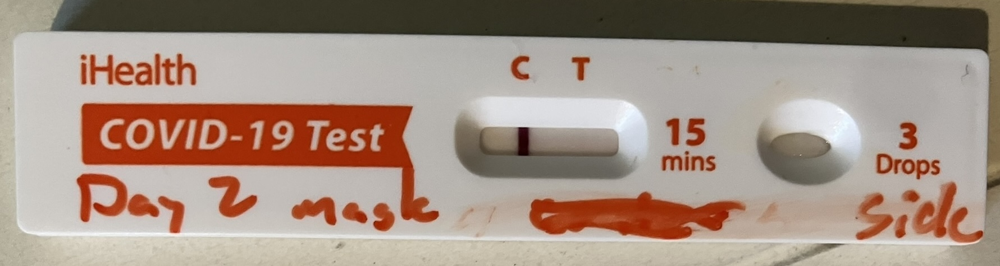

# X thread 1893095652462338263

Source: https://x.com/famulare_mike/status/1893095652462338263
Captured: 2026-06-19T20:36:32.525Z
Tweets captured: 13

## Top-level tweet: 1893095652462338263

- Author: Mike Famulare @famulare_mike
- Time: 2025-02-22T00:29:10.000Z
- URL: https://x.com/famulare_mike/status/1893095652462338263

Feeling okay so far, so let the science fun begin!

(Not gonna lie, I've been happy to avoid COVID for the last 5 years, but I've been looking forward to having fun with it, god-willing, when it got me.)

---

## Reply: 1893095664592265674

- Author: Mike Famulare @famulare_mike
- Time: 2025-02-22T00:29:13.000Z
- URL: https://x.com/famulare_mike/status/1893095664592265674

First, this red hot positive today is on what I think is day 2 of symptoms.

Interestingly, my first symptoms were probably achey legs yesterday. (Vascular disease much??) Since last night, mild sore throat and some stuffiness. Was expecting flu or nada, COVID was a surprise!

---

## Reply: 1893095689095389549

- Author: Mike Famulare @famulare_mike
- Time: 2025-02-22T00:29:18.000Z
- URL: https://x.com/famulare_mike/status/1893095689095389549

Now, to the fun. I put a fresh 3M Vflex n-95 on for the last hour. And then I cut two pieces out. One from right in front of the mouth/nose, and one from the top side as far from the droplet "splash zone" as possible. And then put both cutouts in rapid tests. Result?

Media:

---

## Reply: 1893095706396946940

- Author: Mike Famulare @famulare_mike
- Time: 2025-02-22T00:29:23.000Z
- URL: https://x.com/famulare_mike/status/1893095706396946940

The line-of-fire center sample was positive after about a minute, and maybe doubled in intensity over the remaining 14 minutes. I have no cough or sneezing at all, and so this is a measure of virus excreted during tidal breathing.

Media:

---

## Reply: 1893095722377183309

- Author: Mike Famulare @famulare_mike
- Time: 2025-02-22T00:29:26.000Z
- URL: https://x.com/famulare_mike/status/1893095722377183309

The side sample from top-left of the nose was negative.

Each sample was about 1 cm^2 in area, from a total x-sectional mask area of ~200 cm^2. With the mask on, the side surface is nearly parallel with the breath jet, and is far off-axis. So the effective x-section is very low.

Media:

---

## Reply: 1893095734737805472

- Author: Mike Famulare @famulare_mike
- Time: 2025-02-22T00:29:29.000Z
- URL: https://x.com/famulare_mike/status/1893095734737805472

While this is far from a careful test, it's interesting to notice that perhaps the quality of the seal isn't that important for source control, provided the jet region is well-covered. Something to perhaps find some comfort in if when worrying about fit factors on "baggy blues".

---

## Reply: 1893095746578317380

- Author: Mike Famulare @famulare_mike
- Time: 2025-02-22T00:29:32.000Z
- URL: https://x.com/famulare_mike/status/1893095746578317380

This can't disambiguate droplet from fine aerosol shedding. I'll put a mask cutout over the filter material in my HEPA overnight to see what happens. But I also have a box fan blowing out for negative pressure, so I'm not sure there will be enough buildup to measure.🤞🏻 we'll see!

---

## Reply: 1893095758326571334

- Author: Mike Famulare @famulare_mike
- Time: 2025-02-22T00:29:35.000Z
- URL: https://x.com/famulare_mike/status/1893095758326571334

You can read the unrolled version of this thread here:

---

## Reply: 1893371676470948207

- Author: Mike Famulare @famulare_mike
- Time: 2025-02-22T18:45:59.000Z
- URL: https://x.com/famulare_mike/status/1893371676470948207

Round 2: it’s airborne! 🧵

https://x.com/famulare_mike/status/1893095652462338263…

---

## Reply: 1894125749160051119

- Author: Mike Famulare @famulare_mike
- Time: 2025-02-24T20:42:24.000Z
- URL: https://x.com/famulare_mike/status/1894125749160051119

Brief interlude. Viral load still frustratingly high despite two days of paxlovid and metformin. Not a surprise given the data, but still. 😡

So how do we help keep the bathroom clear, since we don’t have hepas and windows like everywhere else? Far UV-C from @NukitToBeSure!  x.com/famulare_mike/…

---

## Reply: 1894834624272179463

- Author: Mike Famulare @famulare_mike
- Time: 2025-02-26T19:39:13.000Z
- URL: https://x.com/famulare_mike/status/1894834624272179463

Feeling a sudden urge to review these nearly odorless candles… x.com/famulare_mike/…

---

## Reply: 1895617567722729601

- Author: Mike Famulare @famulare_mike
- Time: 2025-02-28T23:30:21.000Z
- URL: https://x.com/famulare_mike/status/1895617567722729601

New COVID personal science thread: observations on viral load.🧵

Fun inside!

Viral load plummeted after 4 days of Paxlovid. I did some math* to estimate changes in viral load.

*somewhere between back-of-the-envelope and semi-quantitative modeling
https://x.com/famulare_mike/status/1894124001204867424…

---

## Reply: 1895617673398260101

- Author: Mike Famulare @famulare_mike
- Time: 2025-02-28T23:30:46.000Z
- URL: https://x.com/famulare_mike/status/1895617673398260101

Next thread: relative infectiousness via mask samples. tl;dr: I'm probably at least 5000x less contagious yesterday (day 8 of symptoms, day 5 of Paxlovid) than I was on day 2 (peak).

https://x.com/famulare_mike/status/1894899637217304636…

---
