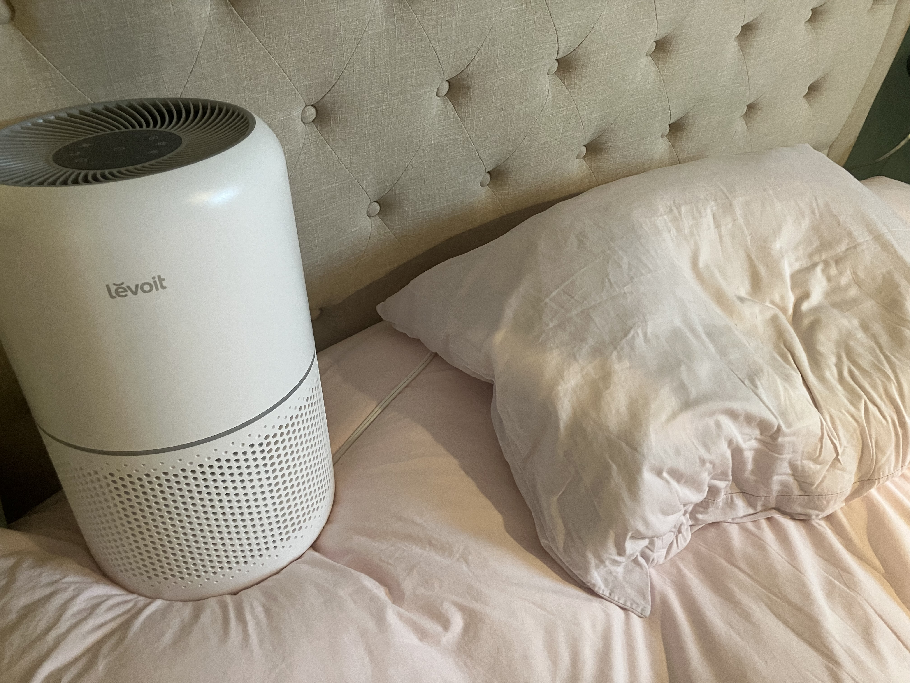
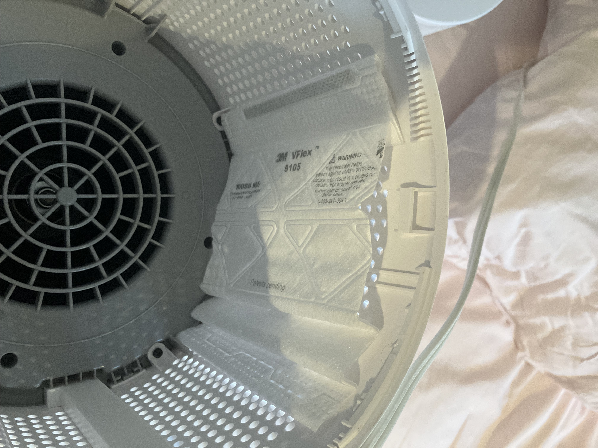
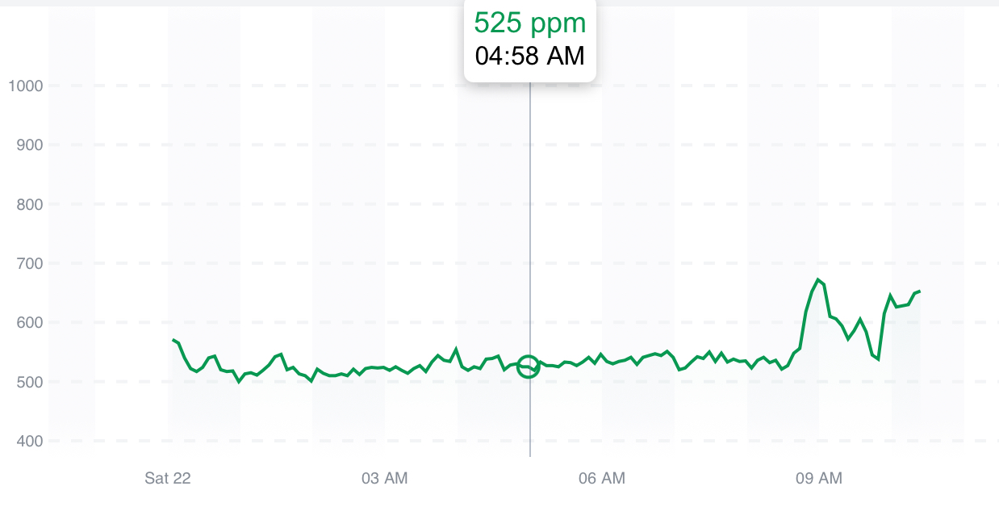
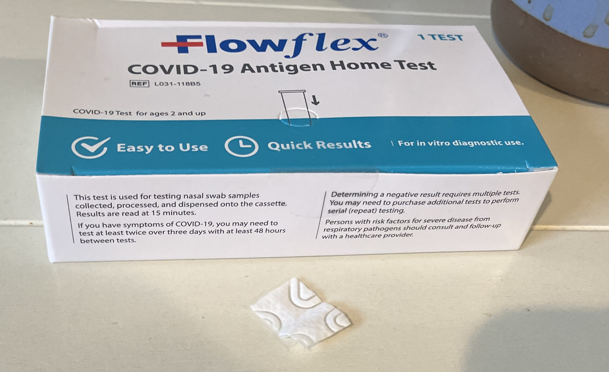
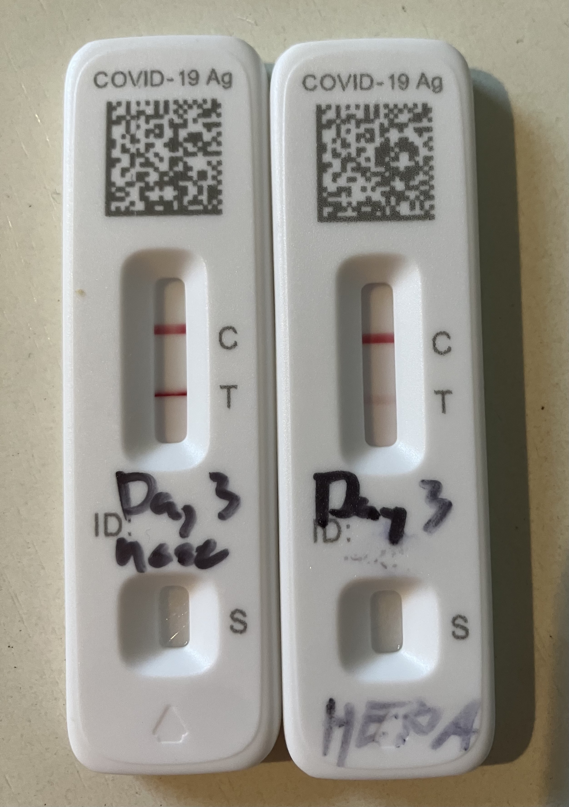

# X thread 1893370704663568511

Source: https://x.com/famulare_mike/status/1893370704663568511
Captured: 2026-06-19T20:36:32.525Z
Tweets captured: 7

## Top-level tweet: 1893370704663568511

- Author: Mike Famulare @famulare_mike
- Time: 2025-02-22T18:42:07.000Z
- URL: https://x.com/famulare_mike/status/1893370704663568511

Round 2: it’s airborne! 🧵

---

## Reply: 1893370749051904069

- Author: Mike Famulare @famulare_mike
- Time: 2025-02-22T18:42:18.000Z
- URL: https://x.com/famulare_mike/status/1893370749051904069

Last night, I put a mask filter inside my hepa and left it near my pillow, in the direction I tend to face while sleeping, about 18 inches away. Because the mask was inside the machine, there was no path for ballistic droplets to get to it. Only exposure is fine aerosols.

Media:

---

## Reply: 1893370768345702502

- Author: Mike Famulare @famulare_mike
- Time: 2025-02-22T18:42:22.000Z
- URL: https://x.com/famulare_mike/status/1893370768345702502

Why near the pillow? Because I also ran the fan blowing out to keep viral concentrations low and to prevent leakage into the house. CO2 ~525ppm all night.

Media:

---

## Reply: 1893370803523367258

- Author: Mike Famulare @famulare_mike
- Time: 2025-02-22T18:42:31.000Z
- URL: https://x.com/famulare_mike/status/1893370803523367258

Result after testing a square centimeter of mask filter? Positive! (Nose/throat this morning on left, overnight HEPA on right).

Media:

---

## Reply: 1893370817444225062

- Author: Mike Famulare @famulare_mike
- Time: 2025-02-22T18:42:34.000Z
- URL: https://x.com/famulare_mike/status/1893370817444225062

Despite only covering ~1/4 the hepa filter surface with a mask, and being in a very well ventilated room, I got direct evidence of virus excretion on fine aerosols.

Not a surprise as it’s been very well studied, but fun to see at home! There really is no room left for doubt.

---

## Reply: 1893370829196644751

- Author: Mike Famulare @famulare_mike
- Time: 2025-02-22T18:42:37.000Z
- URL: https://x.com/famulare_mike/status/1893370829196644751

You can read the unrolled version of this thread here:

---

## Reply: 1893373360735732220

- Author: Mike Famulare @famulare_mike
- Time: 2025-02-22T18:52:41.000Z
- URL: https://x.com/famulare_mike/status/1893373360735732220

Thankfully still feeling fine. Started paxlovid this morning, so the next round of experiments will be about how fast viral load crashes out. Stay tuned!

---
