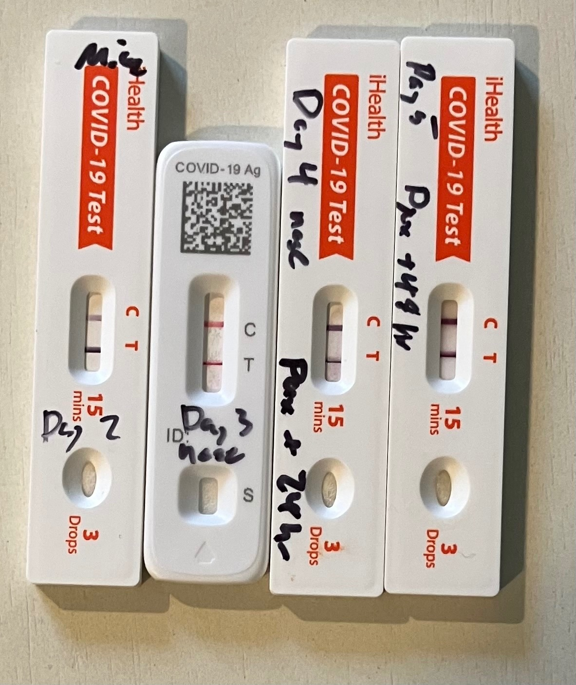

# X thread 1894124001204867424

Source: https://x.com/famulare_mike/status/1894124001204867424
Captured: 2026-06-19T20:36:32.526Z
Tweets captured: 2

## Top-level tweet: 1894124001204867424

- Author: Mike Famulare @famulare_mike
- Time: 2025-02-24T20:35:27.000Z
- URL: https://x.com/famulare_mike/status/1894124001204867424

Brief interlude. Viral load still frustratingly high despite two days of paxlovid and metformin. Not a surprise given the data, but still. 😡

So how do we help keep the bathroom clear, since we don’t have hepas and windows like everywhere else? Far UV-C from @NukitToBeSure!

Media:

---

## Reply: 1894124704702816428

- Author: Mike Famulare @famulare_mike
- Time: 2025-02-24T20:38:15.000Z
- URL: https://x.com/famulare_mike/status/1894124704702816428

Unfortunately my wife tested positive Sunday. I probably got her in the first twelve hours overnight, before the v-flex came out. Toddler still negative, and as asymptomatic as she ever is at this age, so I’m putting the 10,000x fit factor of a 3M v-flex to the test! 🤞🏻

---
