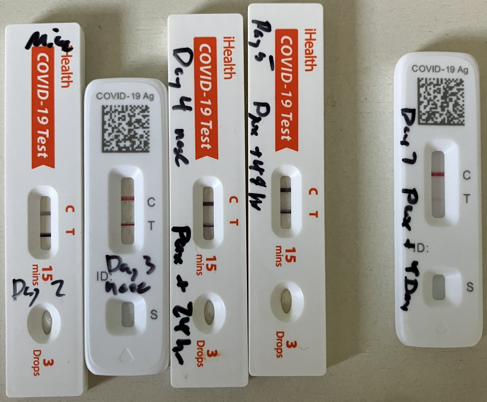
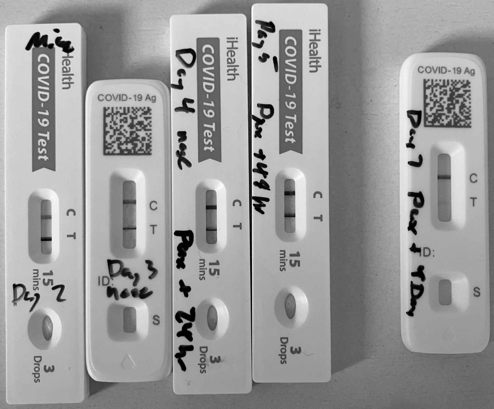
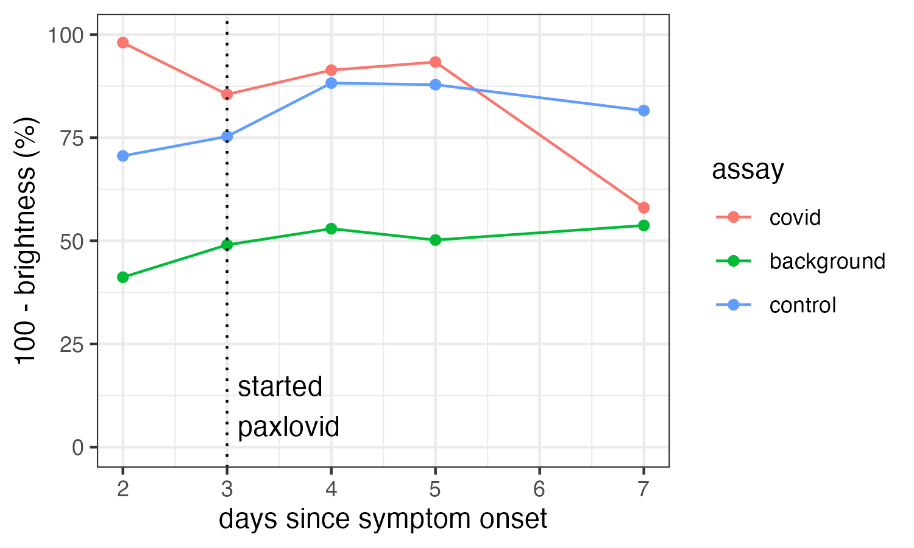
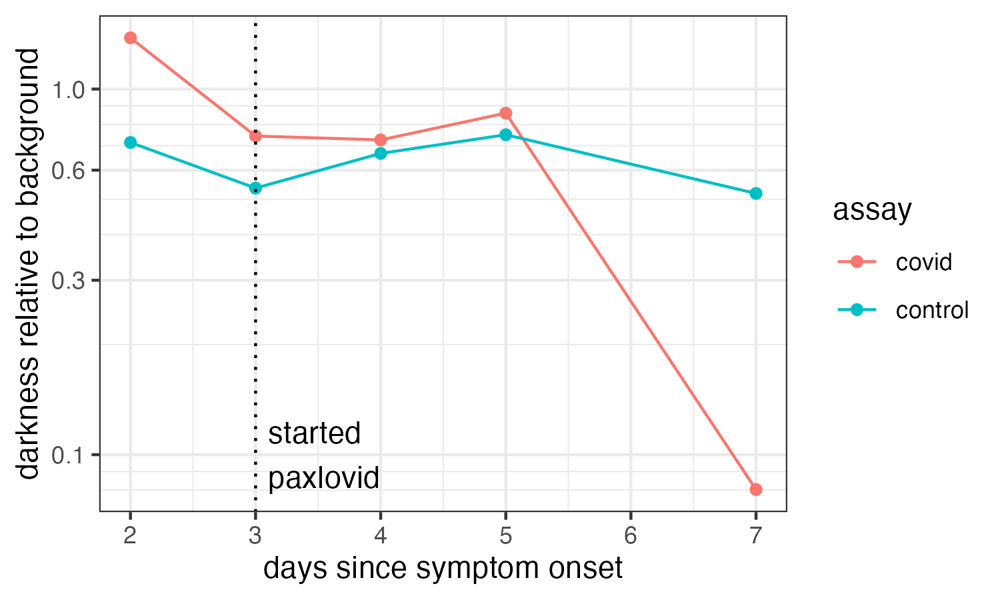
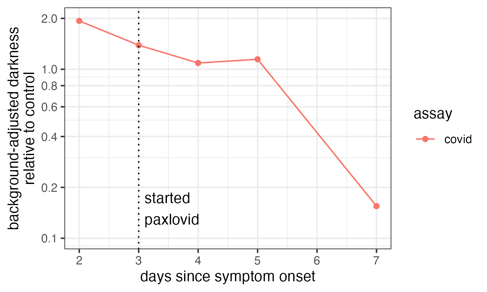
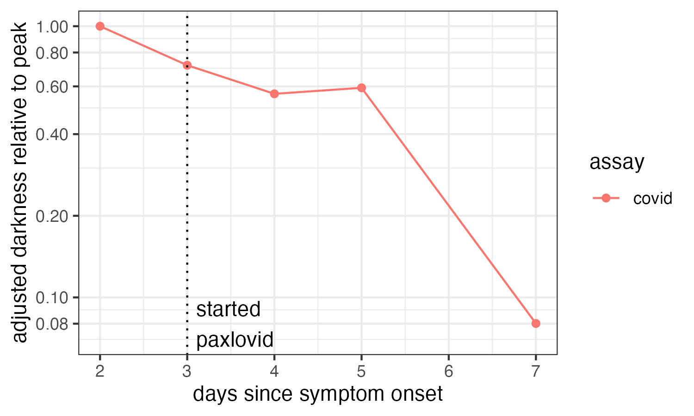
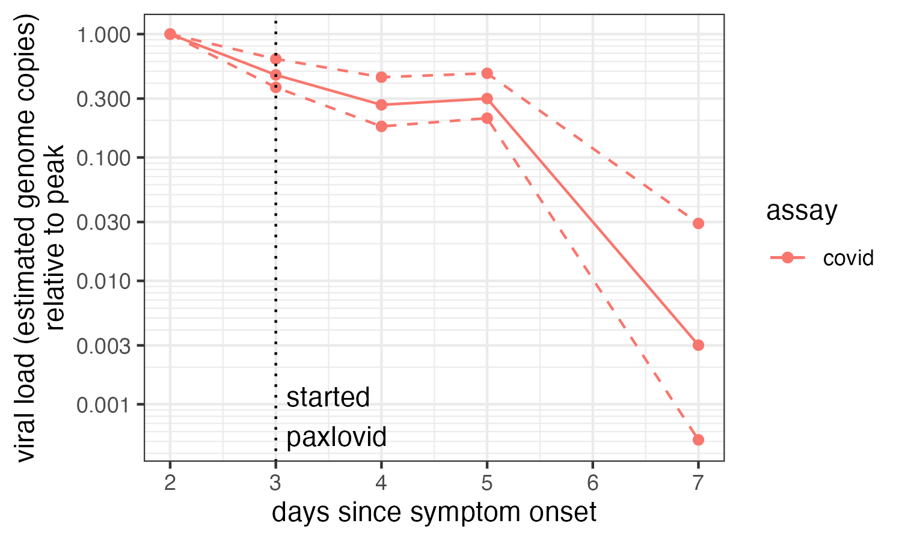
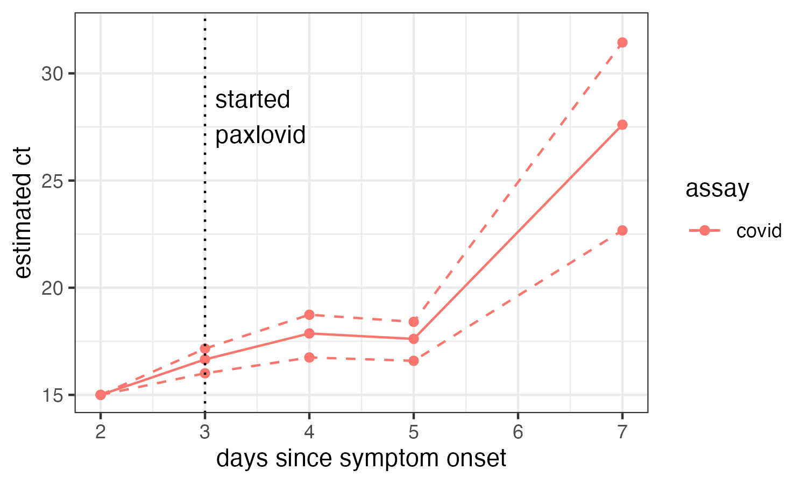

# X thread 1894899637217304636

Source: https://x.com/famulare_mike/status/1894899637217304636
Captured: 2026-06-19T20:36:32.526Z
Tweets captured: 19

## Top-level tweet: 1894899637217304636

- Author: Mike Famulare @famulare_mike
- Time: 2025-02-26T23:57:33.000Z
- URL: https://x.com/famulare_mike/status/1894899637217304636

New COVID personal science thread: observations on viral load.🧵

Fun inside!

Viral load plummeted after 4 days of Paxlovid. I did some math* to estimate changes in viral load.

*somewhere between back-of-the-envelope and semi-quantitative modeling
https://x.com/famulare_mike/status/1894124001204867424…

Media:

---

## Reply: 1894899655848403412

- Author: Mike Famulare @famulare_mike
- Time: 2025-02-26T23:57:38.000Z
- URL: https://x.com/famulare_mike/status/1894899655848403412

As you can see, I went from screaming hot viral load on symptomatic days 2 thru 5, to very low but still detectable on day 7.  Along the way, on day 5, I lost much of my sense of taste and smell, but it started coming back yesterday and is not bad today.

Media:

---

## Reply: 1894899668787818579

- Author: Mike Famulare @famulare_mike
- Time: 2025-02-26T23:57:41.000Z
- URL: https://x.com/famulare_mike/status/1894899668787818579

Because I'm annoyed we don't have app readers to turn rapid tests into semiquantitative readouts of viral load, even though it's obvious to everyone who uses them that you can read out relative viral load with the intensity (and time to positive), I did some analysis.

---

## Reply: 1894899689578979735

- Author: Mike Famulare @famulare_mike
- Time: 2025-02-26T23:57:46.000Z
- URL: https://x.com/famulare_mike/status/1894899689578979735

First, convert to grayscale and use a color picker to grab approximate absolute brightness data for the test line, the control line, and the test strip background. Put that in a spreadsheet and plot.

Media:

---

## Reply: 1894899705106309477

- Author: Mike Famulare @famulare_mike
- Time: 2025-02-26T23:57:49.000Z
- URL: https://x.com/famulare_mike/status/1894899705106309477

Second, normalize the test and control data by the background to get the excess darkness relative to the lighting and materials (and put it on a log scale). The control line is less variable now, although there is still a difference between flowflex (day 2,7) and iHealth.

Media:

---

## Reply: 1894899720667177320

- Author: Mike Famulare @famulare_mike
- Time: 2025-02-26T23:57:53.000Z
- URL: https://x.com/famulare_mike/status/1894899720667177320

So, we go one step further to normalize the test line darkness relative to the control. And now we have a nice time trend of antigen detected.

Media:

---

## Reply: 1894899736316125345

- Author: Mike Famulare @famulare_mike
- Time: 2025-02-26T23:57:57.000Z
- URL: https://x.com/famulare_mike/status/1894899736316125345

And since the y-axis units don't have an absolute scale anymore, let's also just plot it as adjusted darkness relative to peak. What we see by eye at the top is now clear: after a small decline in antigen detected over the first 5 days, day 7 was ~12x less intense.

Media:

---

## Reply: 1894899749091975498

- Author: Mike Famulare @famulare_mike
- Time: 2025-02-26T23:58:00.000Z
- URL: https://x.com/famulare_mike/status/1894899749091975498

From there, what does that mean for my viral load (and likely infectiousness). For that, we need some idea of how more quantitative measures like pcr ct and genome copies vary with lateral flow test antigen binding. I couldn't find one paper that does that for either test, sooo

---

## Reply: 1894899760823443585

- Author: Mike Famulare @famulare_mike
- Time: 2025-02-26T23:58:03.000Z
- URL: https://x.com/famulare_mike/status/1894899760823443585

So I stitched together some bits from a few papers to get the gist.

1) https://pmc.ncbi.nlm.nih.gov/articles/PMC11237673/pdf/spectrum.00073-24.pdf…
2) https://pmc.ncbi.nlm.nih.gov/articles/PMC9031584/…
3) https://nature.com/articles/s41598-021-02128-y…

I'm too tired right now to document for twitter how the next few images came to be, but I'll post code eventually..

---

## Reply: 1894899772689129542

- Author: Mike Famulare @famulare_mike
- Time: 2025-02-26T23:58:06.000Z
- URL: https://x.com/famulare_mike/status/1894899772689129542

A careful look at this stuff finds that genome copy number is not linear in antigen test line intensity. Rather, depending on the dataset and the paper, you can work through either direct genomes vs intensity or genomes to ct to intensity to find...

---

## Reply: 1894899784747782522

- Author: Mike Famulare @famulare_mike
- Time: 2025-02-26T23:58:08.000Z
- URL: https://x.com/famulare_mike/status/1894899784747782522

genome copies is proproptional to color intensity to a power of between-ish 1.4 and 3. I think what's going on is intensity is linearly proportional to genomes at low signal, but nonlinear diffusion-binding-optical junk kicks in at higher concentrations, so studies differ.

---

## Reply: 1894899796483416426

- Author: Mike Famulare @famulare_mike
- Time: 2025-02-26T23:58:11.000Z
- URL: https://x.com/famulare_mike/status/1894899796483416426

And the dynamic range of rapid tests with pcr ct is well-known to be something like ct =15 (for the hottest infection ever) to ct ~30 for rapid test negative.

---

## Reply: 1894899818742587738

- Author: Mike Famulare @famulare_mike
- Time: 2025-02-26T23:58:16.000Z
- URL: https://x.com/famulare_mike/status/1894899818742587738

So anwyay, with that in mind, I can stich together estimates of the pcr-equvialent ct value I would've likely had, and the relative genome copies from peak. Here ya go!

Media:

---

## Reply: 1894899831421964712

- Author: Mike Famulare @famulare_mike
- Time: 2025-02-26T23:58:20.000Z
- URL: https://x.com/famulare_mike/status/1894899831421964712

This is cool, because I find it really useful to know that I'm something like 30-200x less infectious per minute of contact than I was a few days ago.

---

## Reply: 1894899843266736336

- Author: Mike Famulare @famulare_mike
- Time: 2025-02-26T23:58:22.000Z
- URL: https://x.com/famulare_mike/status/1894899843266736336

At onset, I could've been an epic superspreader if I hung out in a crowded space. I felt fine. I've mostly felt fine this whole time. If I wasn't very curious (and thought I might have flu), I'd never have known! Even with so much immunization, superpreading remains a thing.

---

## Reply: 1894899854964597004

- Author: Mike Famulare @famulare_mike
- Time: 2025-02-26T23:58:25.000Z
- URL: https://x.com/famulare_mike/status/1894899854964597004

Second, now I still have to be cautious around my family, but I am able to feel a lot more relaxed about my n-95 getting the job done. That takes a large mental load off.

---

## Reply: 1894899866666688785

- Author: Mike Famulare @famulare_mike
- Time: 2025-02-26T23:58:28.000Z
- URL: https://x.com/famulare_mike/status/1894899866666688785

Anyway, I wish we had standard tools for this. This kind of thinking would be way easier if it was just published for every test. And, I didn't do this analysis for mask viral load (aerosols), but nose/throat swab. It would be easy to make that correlation standard too.

---

## Reply: 1894899878536634606

- Author: Mike Famulare @famulare_mike
- Time: 2025-02-26T23:58:31.000Z
- URL: https://x.com/famulare_mike/status/1894899878536634606

We could know so much more about bespoke, personalized infectiousness! Which would make mitigation easier, more specific, and more palatable. I was hoping that future would come to pass 4 years ago. I hope for it still!

---

## Reply: 1894899890179973552

- Author: Mike Famulare @famulare_mike
- Time: 2025-02-26T23:58:34.000Z
- URL: https://x.com/famulare_mike/status/1894899890179973552

You can read the unrolled version of this thread here:

---
