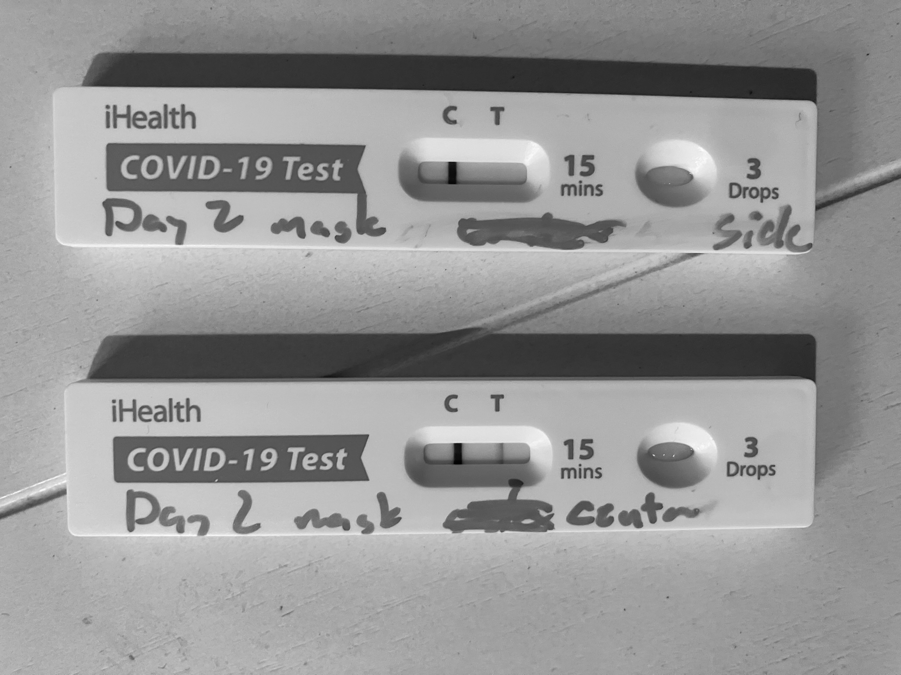
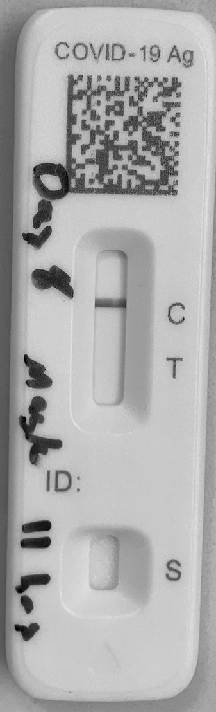
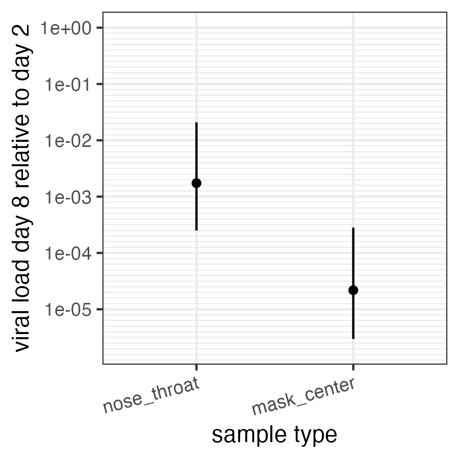

# X thread 1895616959083053369

Source: https://x.com/famulare_mike/status/1895616959083053369
Captured: 2026-06-19T20:36:32.527Z
Tweets captured: 15

## Top-level tweet: 1895616959083053369

- Author: Mike Famulare @famulare_mike
- Time: 2025-02-28T23:27:56.000Z
- URL: https://x.com/famulare_mike/status/1895616959083053369

Next thread: relative infectiousness via mask samples. tl;dr: I'm probably at least 5000x less contagious yesterday (day 8 of symptoms, day 5 of Paxlovid) than I was on day 2 (peak).

---

## Reply: 1895616971200418127

- Author: Mike Famulare @famulare_mike
- Time: 2025-02-28T23:27:59.000Z
- URL: https://x.com/famulare_mike/status/1895616971200418127

As I lazily described here, you can do some simple image processing to make rapid tests quantitative

---

## Reply: 1895616983003250921

- Author: Mike Famulare @famulare_mike
- Time: 2025-02-28T23:28:02.000Z
- URL: https://x.com/famulare_mike/status/1895616983003250921

And here I showed how to test an n-95 for exhaled virus

---

## Reply: 1895616994936025598

- Author: Mike Famulare @famulare_mike
- Time: 2025-02-28T23:28:05.000Z
- URL: https://x.com/famulare_mike/status/1895616994936025598

So we can put these together and compare exhaled viral load changes with nasal/throat swab changes, to get as close a proxy for contagiousness as possible!

---

## Reply: 1895617006633922949

- Author: Mike Famulare @famulare_mike
- Time: 2025-02-28T23:28:07.000Z
- URL: https://x.com/famulare_mike/status/1895617006633922949

Unfortunately, I only have two good mask samples (because I wasn't planning on doing this quantitative stuff until a few days ago).

- 1 hour on day 2 of symptoms when I was red hot by nose

- 11 hours yesterday (day 8) when I was still faintly positive at ~200x lower viral load

---

## Reply: 1895617024023560371

- Author: Mike Famulare @famulare_mike
- Time: 2025-02-28T23:28:12.000Z
- URL: https://x.com/famulare_mike/status/1895617024023560371

The day 2 mask after an hour was positive, solidly at the mouth and juuuust barely at the top by the nose, out of the jet zone. (The side sample looks negative by eye, but the brightness dips very slightly, from background ~140/255 to test ~137/255, as seen with a color picker.)

Media:

---

## Reply: 1895617040641400957

- Author: Mike Famulare @famulare_mike
- Time: 2025-02-28T23:28:16.000Z
- URL: https://x.com/famulare_mike/status/1895617040641400957

The day 8 mask, even after 11 hours, was NEGATIVE negative. No signal from background at all.

Media:

---

## Reply: 1895617056697114989

- Author: Mike Famulare @famulare_mike
- Time: 2025-02-28T23:28:19.000Z
- URL: https://x.com/famulare_mike/status/1895617056697114989

So, just for fun, the figures below shows the precise estimate for the relative viral load for the nose and mask on day 8 vs day 2, and the upper bound for the mask

Media:

---

## Reply: 1895617069250719954

- Author: Mike Famulare @famulare_mike
- Time: 2025-02-28T23:28:22.000Z
- URL: https://x.com/famulare_mike/status/1895617069250719954

As you can see, quantitatively, I’m at least 5000x less contagious via the air than yesterday (and possibly infinitely less). So, I am very very likely no longer contagious! I’m also at least 70x less infectious by saliva. So I probably can't infect anyone else now!

---

## Reply: 1895617081196040624

- Author: Mike Famulare @famulare_mike
- Time: 2025-02-28T23:28:25.000Z
- URL: https://x.com/famulare_mike/status/1895617081196040624

I will mask until twice negative on the nose because why not? (Also, gotta watch for rebound!)

---

## Reply: 1895617092810129676

- Author: Mike Famulare @famulare_mike
- Time: 2025-02-28T23:28:28.000Z
- URL: https://x.com/famulare_mike/status/1895617092810129676

How cool is it to have quantitative measures of contagiousness?! With an app reader for the image processing, and instructions for mask testing, everyone could have this.

---

## Reply: 1895617104440934702

- Author: Mike Famulare @famulare_mike
- Time: 2025-02-28T23:28:31.000Z
- URL: https://x.com/famulare_mike/status/1895617104440934702

With more rigorous correlation of antigen test color, pcr ct, and existing studies correlated ct with transmission, we could have quantitative transmission risk measures for anyone who tests. Beyond satisfying my curiosity, I hope having these examples will help me advocate.

---

## Reply: 1895617116134691316

- Author: Mike Famulare @famulare_mike
- Time: 2025-02-28T23:28:34.000Z
- URL: https://x.com/famulare_mike/status/1895617116134691316

Addendum: I'm out of FlowFlex and iHealth tests, so I got a few crappy BinaxNow (I can't get a solid control line on these...), and I'm nose/thoat negative on Day 9.5. The upper bound is probably above my last two FlowFlex, so not sure what to make of it.

---

## Reply: 1895617127954203032

- Author: Mike Famulare @famulare_mike
- Time: 2025-02-28T23:28:36.000Z
- URL: https://x.com/famulare_mike/status/1895617127954203032

Still tired and taking daily naps, but otherwise fine. Fingers crossed I throw a few more negatives and I'm freed on Monday.

The Mrs is doing well too, but still testing quantitatively more positive than me.

Daughter holding negative. Thanks masks, HEPAs, and windows!

---

## Reply: 1895619656209350776

- Author: Mike Famulare @famulare_mike
- Time: 2025-02-28T23:38:39.000Z
- URL: https://x.com/famulare_mike/status/1895619656209350776

[no text]

---
