# X thread 1897429800710758413

Source: https://x.com/famulare_mike/status/1897429800710758413
Captured: 2026-06-19T22:10:35.019Z
Tweets captured: 31

## Top-level tweet: 1897429800710758413

- Author: Mike Famulare @famulare_mike
- Time: 2025-03-05T23:31:31.000Z
- URL: https://x.com/famulare_mike/status/1897429800710758413

The Famulare family COVID saga continues. Up today: rebound 🤬

https://x.com/famulare_mike/status/1895616959083053369…

With my wife Marisa's consent, here is our estimated nose/throat viral load history relative to peak since I first tested positive on day 2 of my symptoms. We're both experiencing rebound!

Media:
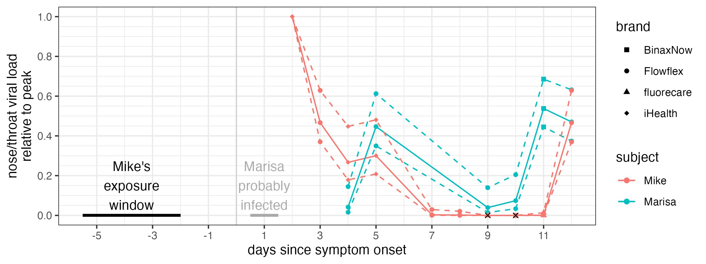

---

## Reply: 1897429818641408078

- Author: Mike Famulare @famulare_mike
- Time: 2025-03-05T23:31:35.000Z
- URL: https://x.com/famulare_mike/status/1897429818641408078

Here's the same with log10-y. So yeah, we've both rebounded. I took paxlovid days 3-7 (and have been on metformin since day 2). My load crashed by day 7 and went negative days 9 and 10. Marisa hasn't had any treatments, and never went negative, but 10-fold rebound regardless.

Media:
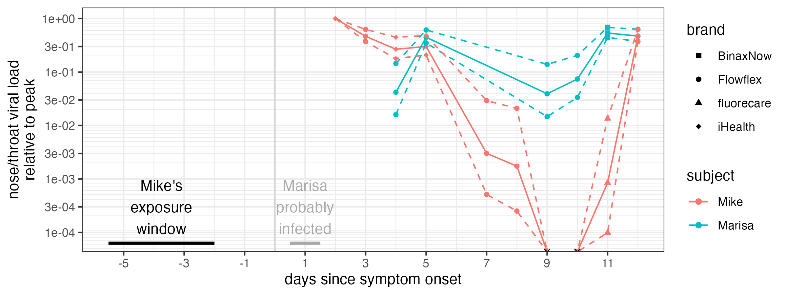

---

## Reply: 1897429831798895063

- Author: Mike Famulare @famulare_mike
- Time: 2025-03-05T23:31:39.000Z
- URL: https://x.com/famulare_mike/status/1897429831798895063

BTW I described how to turn rapid test color into a quantitative assay here https://x.com/famulare_mike/status/1894899637217304636…, and here's the code and data https://github.com/famulare/famulare.github.io/tree/master/assets/2025-02-26-My-First-COVID-Infection….

---

## Reply: 1897429843756900566

- Author: Mike Famulare @famulare_mike
- Time: 2025-03-05T23:31:41.000Z
- URL: https://x.com/famulare_mike/status/1897429843756900566

First, it's annoying! We're very ready to be done. We're tired of not having Marisa's parents visit. Of masking around our toddler (who hasn't caught it yet, as far as tests and symptoms say). Of runny noses. Of being tired. And Marisa, who has had it worse, is tired of coughing!

---

## Reply: 1897429855555457307

- Author: Mike Famulare @famulare_mike
- Time: 2025-03-05T23:31:44.000Z
- URL: https://x.com/famulare_mike/status/1897429855555457307

But, because at least it's fascinating, I've been doing a lot of rapid tests on interesting samples on myself. So let's get into some interesting stuff.

---

## Reply: 1897429867341472210

- Author: Mike Famulare @famulare_mike
- Time: 2025-03-05T23:31:47.000Z
- URL: https://x.com/famulare_mike/status/1897429867341472210

I tested on day 11 after testing negative twice because I noticed my nose was running just a little bit more and I was a bit more tired than the day before, and I was curious about rebound. Sure enough, I got a very faint positive.

---

## Reply: 1897429878913602036

- Author: Mike Famulare @famulare_mike
- Time: 2025-03-05T23:31:50.000Z
- URL: https://x.com/famulare_mike/status/1897429878913602036

That night, I was visited by GI distress! This is not a big surprise as we know COVID is shed in stool and can settle in the gut for the long haul, especially in someone like me who takes a B-cell-depleting therapy for MS and can't make new antibodies.

---

## Reply: 1897429890473058429

- Author: Mike Famulare @famulare_mike
- Time: 2025-03-05T23:31:53.000Z
- URL: https://x.com/famulare_mike/status/1897429890473058429

That said, I've tried three different approaches to get a fecal rapid test, but all have been negative. But I can't be sure if the virus isn't there or the tests don't work with that medium...

---

## Reply: 1897429902091280806

- Author: Mike Famulare @famulare_mike
- Time: 2025-03-05T23:31:55.000Z
- URL: https://x.com/famulare_mike/status/1897429902091280806

- first try: sample probably too acidic: got weird transient positives on flu B and rsv but always covid-neg
- second: swab of solids, one minute in buffer, covid-negative
- third, swab of toilet water + solids, 5 minutes in buffer, covid-negative

@SolidEvidence thoughts?

---

## Reply: 1897429919355035898

- Author: Mike Famulare @famulare_mike
- Time: 2025-03-05T23:31:59.000Z
- URL: https://x.com/famulare_mike/status/1897429919355035898

So anyway, stool sampling with rapid tests has been a letdown, but mask, hepa, nose, and throat sampling have been interesting! Here's a panel of days I tested samples from sites other than combined nose-throat. Y-axis is est. viral load relative to nose-throat day 2 (peak).

Media:
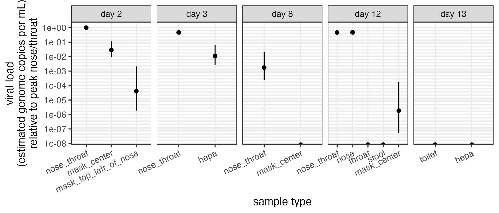

---

## Reply: 1897429932646785186

- Author: Mike Famulare @famulare_mike
- Time: 2025-03-05T23:32:03.000Z
- URL: https://x.com/famulare_mike/status/1897429932646785186

First up, masks. tl;dr: mask and nose viral load tell different stories over time! And I'm very likely a lot less infectious via the air now than at the start.

---

## Reply: 1897429944441168095

- Author: Mike Famulare @famulare_mike
- Time: 2025-03-05T23:32:05.000Z
- URL: https://x.com/famulare_mike/status/1897429944441168095

As discussed here, on day 2, I was able to pull virus off a mask worn for an hour https://x.com/famulare_mike/status/1893095652462338263…. In front of the mouth was highest viral load, with a very little but non-zero positive away from the mouth. (Wasn't negative like I originally said.)

---

## Reply: 1897429962405372050

- Author: Mike Famulare @famulare_mike
- Time: 2025-03-05T23:32:10.000Z
- URL: https://x.com/famulare_mike/status/1897429962405372050

Overnight from day 2 to day 3, I was able to pull virus off a mask put inside my bedside hepa filter, showing that SARS-CoV-2 was travelling on fine aerosols.  You see that quantified here, as the day 3 hepa measurement.

Media:

---

## Reply: 1897429975684501746

- Author: Mike Famulare @famulare_mike
- Time: 2025-03-05T23:32:13.000Z
- URL: https://x.com/famulare_mike/status/1897429975684501746

On day 8, my nose-throat viral load dropped by a factor of 1000, give or take, and my mask sample was negative, despite wearing it for 11 hours. So good, nose way down, aerosol negative.

---

## Reply: 1897429993745199245

- Author: Mike Famulare @famulare_mike
- Time: 2025-03-05T23:32:17.000Z
- URL: https://x.com/famulare_mike/status/1897429993745199245

But, on day 12, my nose/throat sample is hot a hell again!  Dammit, how infectious am I???

I wore a clean mask for 4.25 hours, through work, talking, singning Moo Baa Fa La La to my daughter, etc. Tested the mask. It was barely positive--at the limit of detection but it's there.

Media:
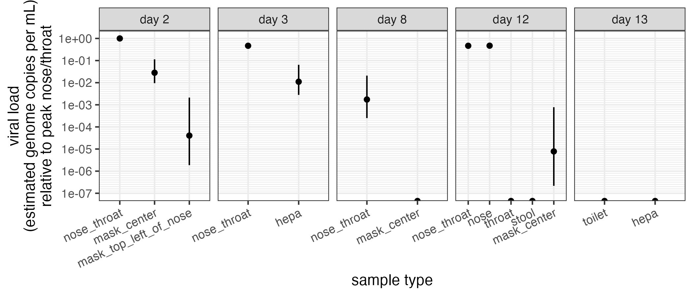

---

## Reply: 1897430006906945642

- Author: Mike Famulare @famulare_mike
- Time: 2025-03-05T23:32:20.000Z
- URL: https://x.com/famulare_mike/status/1897430006906945642

But quantitatively, while my nose swab viral load on day 12 was about ~1/2 of the value on day 2 (so basically the same), the mask viral load is at least 500x lower! Overnight hepa was negative. This is great! There was very likely zero SARS-CoV-2 in my lungs last night.

---

## Reply: 1897430018718097910

- Author: Mike Famulare @famulare_mike
- Time: 2025-03-05T23:32:23.000Z
- URL: https://x.com/famulare_mike/status/1897430018718097910

Even more interestingly, I tested nose and throat independently, instead of with a combined swab. Nose is strongly positive, almost exactly the same test-line-contrast-adjusted level as the nose-throad swab earlier that day. And the throat-only swab was negative.

---

## Reply: 1897430030348923282

- Author: Mike Famulare @famulare_mike
- Time: 2025-03-05T23:32:26.000Z
- URL: https://x.com/famulare_mike/status/1897430030348923282

Throat-only negative. Mask barely barely positive. Nose hot as hell. So?

It's very likely I've got no infectious breath, no infectious spit, but very infectious snot. My only symptoms right now are fading GI, and one stuffy nostril.

NOW I STILL BETTER KEEP WASHING MY HANDS 😂

---

## Reply: 1897430042038452338

- Author: Mike Famulare @famulare_mike
- Time: 2025-03-05T23:32:29.000Z
- URL: https://x.com/famulare_mike/status/1897430042038452338

So anyway, there's what I hope is a fascinating look into a single infection history, so far. I'm disappointed the stool tests are negative, but, as my symptoms calm down, I hope it's because there's very little virus there. I also really hope my wife and I clear this thing soon.

---

## Reply: 1897430054050963658

- Author: Mike Famulare @famulare_mike
- Time: 2025-03-05T23:32:32.000Z
- URL: https://x.com/famulare_mike/status/1897430054050963658

Until then, I'll let you know if anything else interesting comes up. Thanks for reading along!

---

## Reply: 1897430065677479993

- Author: Mike Famulare @famulare_mike
- Time: 2025-03-05T23:32:34.000Z
- URL: https://x.com/famulare_mike/status/1897430065677479993

You can read the unrolled version of this thread here:

---

## Reply: 1897434076581372247

- Author: The Education of O @Ed_of_O
- Time: 2025-03-05T23:48:31.000Z
- URL: https://x.com/Ed_of_O/status/1897434076581372247

Could you also put the days using Paxlovid on this chart?

Did you stop taking it before the rebound?
I don't know why we still don't give 10 day prescriptions for it other than Pfizer charging $300/day.

---

## Reply: 1897435980015321371

- Author: Jeff @SEAsheltie
- Time: 2025-03-05T23:56:04.000Z
- URL: https://x.com/SEAsheltie/status/1897435980015321371

Oof. We got nasty rebound cases too, and we also used Paxlovid. I'm not sure about the level of experimental evidence to back it up but my strong hunch is that Paxlovid causes the rebound.

---

## Reply: 1897436010059063614

- Author: Mike Famulare @famulare_mike
- Time: 2025-03-05T23:56:12.000Z
- URL: https://x.com/famulare_mike/status/1897436010059063614

Here ya go. Yeah, 10 days should be standard now. I ran out after d7, still slightly positive. Since I don't make antibodies at the moment (no b-cells), I'm not surprised it came back. I hope the t-cells clear it out soon. I feel worse for Marisa, who had no reason to expect it!

Media:
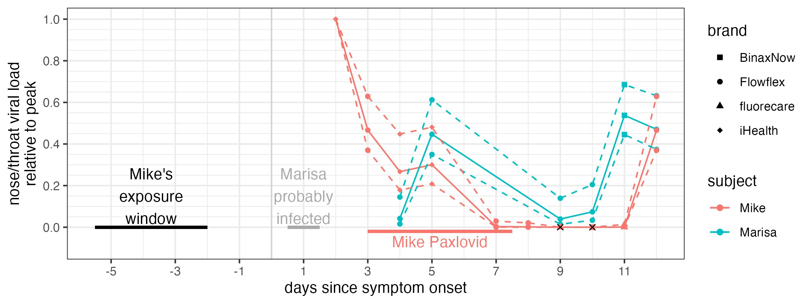

---

## Reply: 1897436156243190261

- Author: Mike Famulare @famulare_mike
- Time: 2025-03-05T23:56:46.000Z
- URL: https://x.com/famulare_mike/status/1897436156243190261

It seems rebound is pretty common (~15%) with or without pax, but most people don't look. Annoying regardless!

---

## Reply: 1897436700227592567

- Author: Jeff @SEAsheltie
- Time: 2025-03-05T23:58:56.000Z
- URL: https://x.com/SEAsheltie/status/1897436700227592567

Yeah I do wonder how much spread has occurred because people refused to keep testing and brushed off the rebound as allergies.

Now I'm curious if other respiratory viruses get rebound. I don't recall ever getting it with the flu or colds.

---

## Reply: 1897463412176904447

- Author: The Education of O @Ed_of_O
- Time: 2025-03-06T01:45:05.000Z
- URL: https://x.com/Ed_of_O/status/1897463412176904447

I assume she also had a rebound after similar Paxlovid treatment but not immunocompromised?

I wonder if anyone has tried half a dose for 10 days... The coatings don't look to be anything special where cutting would change the pharmacokinetics much.

🙏 you both clear it soon.

Media:
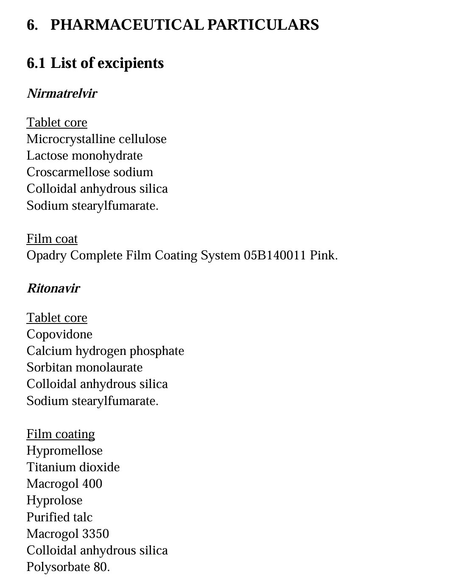

---

## Reply: 1897473917071335680

- Author: Mike Famulare @famulare_mike
- Time: 2025-03-06T02:26:49.000Z
- URL: https://x.com/famulare_mike/status/1897473917071335680

No pax for the missus. Iirc rebound is common enough around 16’t% with/without, when people bother to look. But I’m too lazy to find the paper at the moment.  

You def could split the pills. But perhaps unwise for an antiviral?

---

## Reply: 1897489866931453995

- Author: The Education of O @Ed_of_O
- Time: 2025-03-06T03:30:12.000Z
- URL: https://x.com/Ed_of_O/status/1897489866931453995

Unclear! Haven't found any low dose study for acute infection >5 days or for mild infections

There's one for *hospitalized* patients w/moderate renal impairment who got ½ dose for 5 days & those w/mild to no impairment who got a normal dose

Little diff?
https://sciencedirect.com/science/article/pii/S0166354223001377…

Media:
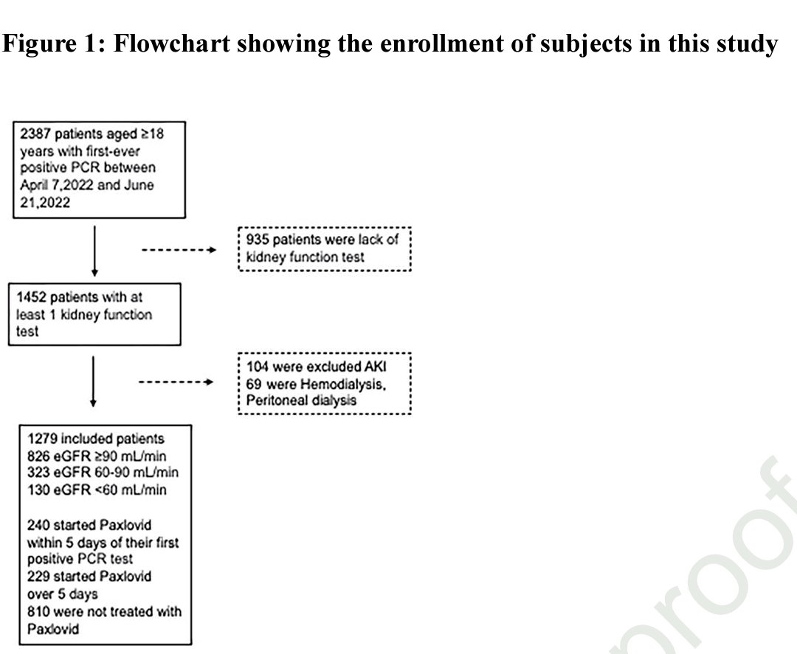
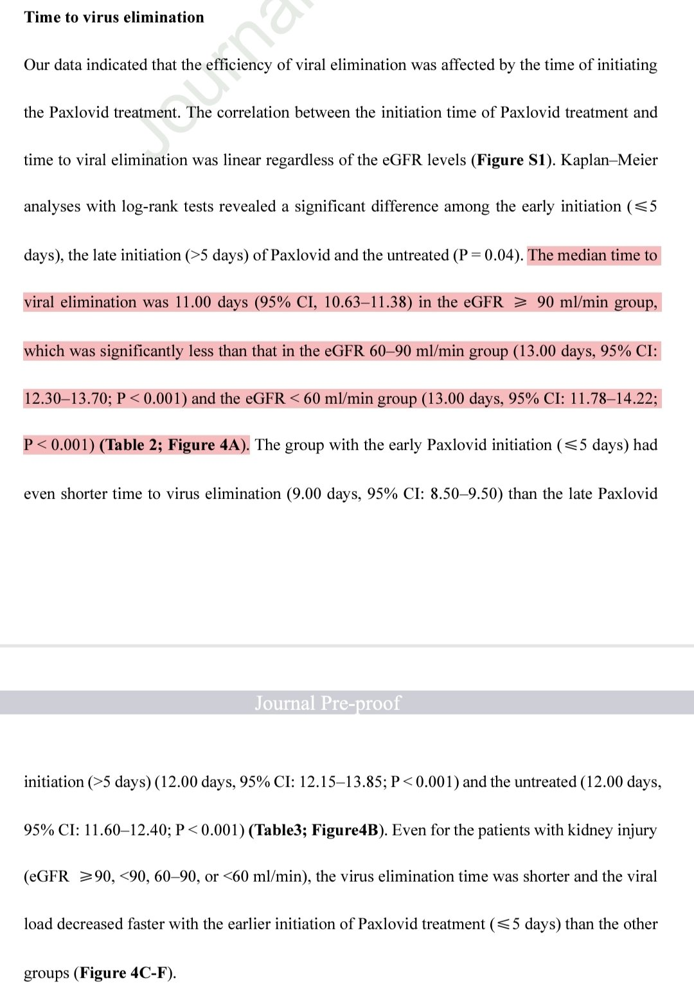
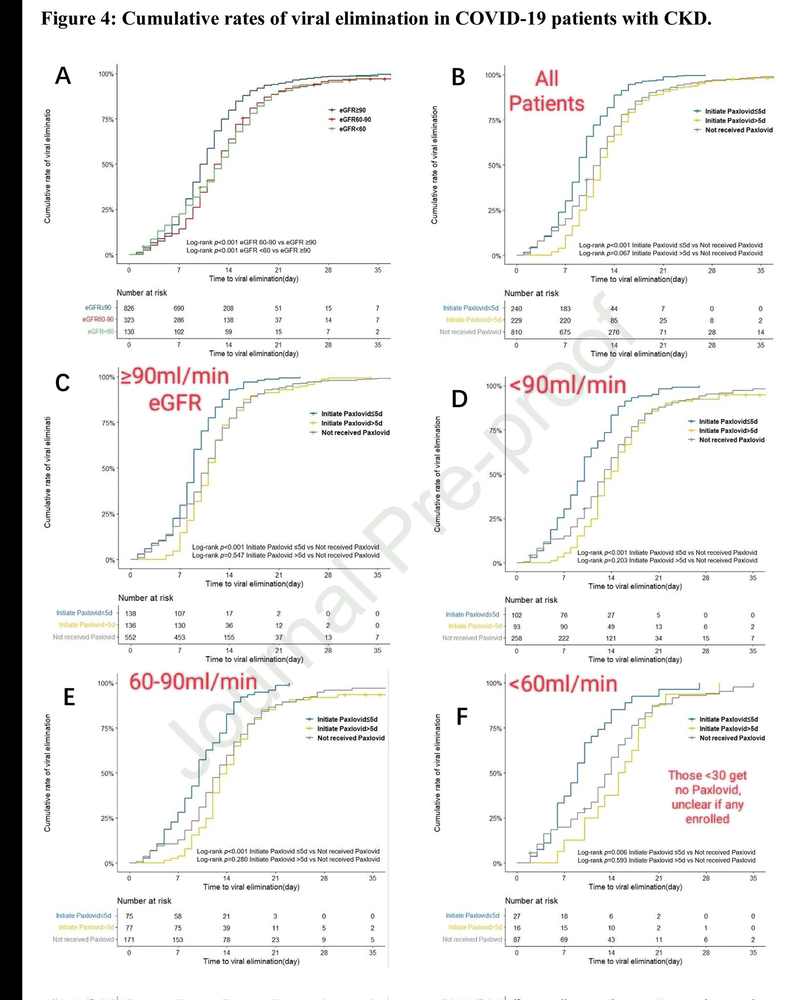

---

## Reply: 1897493136789901331

- Author: The Education of O @Ed_of_O
- Time: 2025-03-06T03:43:12.000Z
- URL: https://x.com/Ed_of_O/status/1897493136789901331

One more caveat.

Ritonavir dose isn't cut and nirmatrelvir is only cut for stage 3 kidney disease

But we can compare hospitalized patients with little kidney disease and a full dose to moderate disease at a half dose of nirmatrelvir. Difference may be mostly insignificant there

Media:
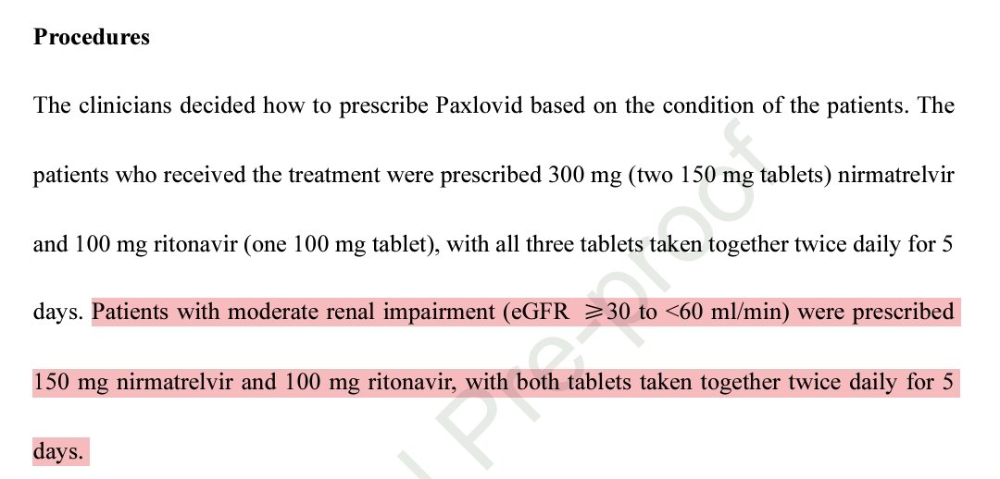
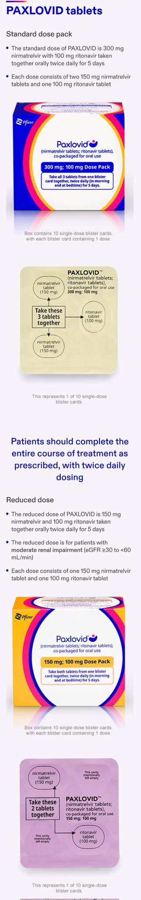

---

## Reply: 1897500395473396134

- Author: Mike Famulare @famulare_mike
- Time: 2025-03-06T04:12:02.000Z
- URL: https://x.com/famulare_mike/status/1897500395473396134

Good refs, thanks!  Although I suppose the biggest takeaway is how little pax does for clearance regardless. Good reminder me and Marisa are still solidly within the distribution.

---
